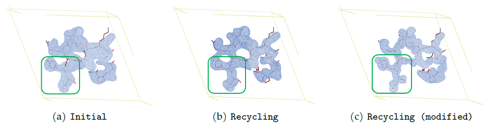

# RecCrysFormer: Refined Protein Structural Prediction from 3D Patterson Maps via Recycling Training Runs

Determining protein structures at an atomic level remains a significant challenge in structural biology. 
We introduce RecCrysFormer, a hybrid model that exploits the strengths of transformers with the aim of integrating experimental and ML approaches to protein structure determination from crystallographic data. 
RecCrysFormer leverages Patterson maps and incorporates known standardized partial structures of amino acid residues to directly predict electron density maps, which are essential for constructing detailed atomic models through crystallographic refinement processes. 
RecCrysFormer benefits from a ``recycling'' training regimen that iteratively incorporates results from crystallographic refinements and previous training runs as additional inputs in the form of template maps. 
Using a preliminary dataset of synthetic peptide fragments based on Protein Data Bank, RecCrysFormer achieves good accuracy in structural predictions and shows robustness against variations in crystal parameters, such as unit cell dimensions and angles.

  

## Additional files
Repopulate the "dataset_gen/2_pdb_reweight_allatom_clean_reorient_center" and "predictions_15_angle" directories with the remaining files extracted from the zenodo dataset.
After extracting the contents of the additional *_ext zenodo files, move all their files into the predictions_15_angle directory.

## Dataset Generation
To generate input and output tensors for training, cd into the dataset_gen directory.   
Then, run the step3_mpi.sh, step4_mpi.sh, ..., step9_mpi.sh scripts in order; this will create additional directories in the parent directory.
step3_mpi.sh, step4_mpi.sh, and step5_mpi.sh require that the ccp4 program suite is installed (https://www.ccp4.ac.uk/); source the path to the installed version of ccp4 in the third line in each of these scripts.
Steps 6, 7, 8, 9 must be manually stopped after completion.
After running step9_mpi.sh in dataset_gen, cd to the parent directory.

## Environment/Dependencies
Requires Torch version >= 1.12.0 and einops version >= 0.6.0.

## Training
Run the initial training run as "python3 train_init.py".
After each training epoch, a line with 5 columns will be printed to the console.  The first displays the epoch number starting from zero, the second the average MSE across the training set, the third the average Pearson correlation across the test set,
the fourth the average Pearson between Fourier transformed and absolute valued predictions and electron densities across the test set, and the fifth the most recent learning rate value.
After this completes, run "python3 get_pred.py" to generate model predictions from the final model state into the predictions_15_angle directory.
This directory already contains provided SHELXE-derived refined maps for 92% of the training set and 79% of the test set.
Finally, run either "python3 train_rec.py" for the original version of our recycling formulation, or "python3 train_rec_modified.py" for the modified version of our recycling formulation, both as described in the text.
The original recycling formulation tends to result in overfitting to refined maps; the modified formulation greatly improves results for predictions that weren't able to be refined after the initial training run.
